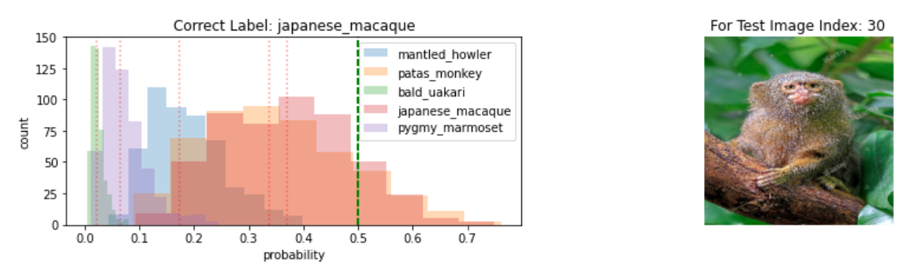
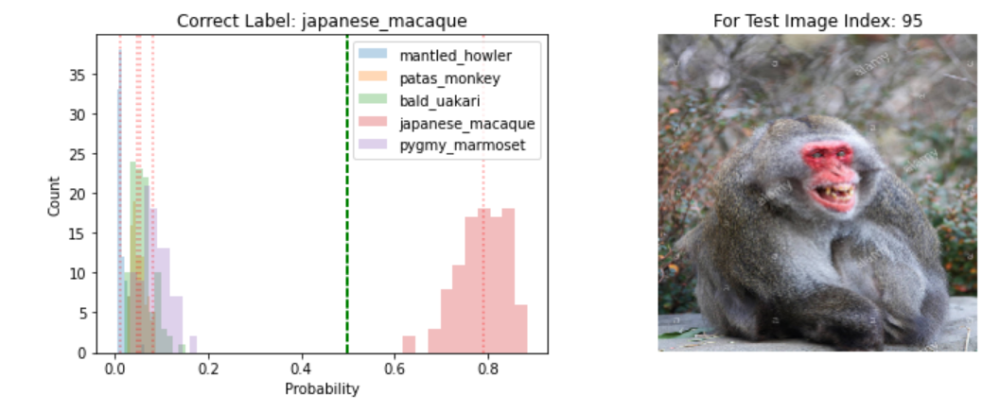
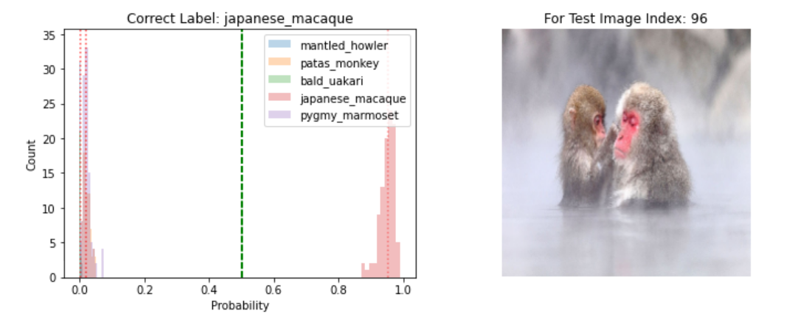
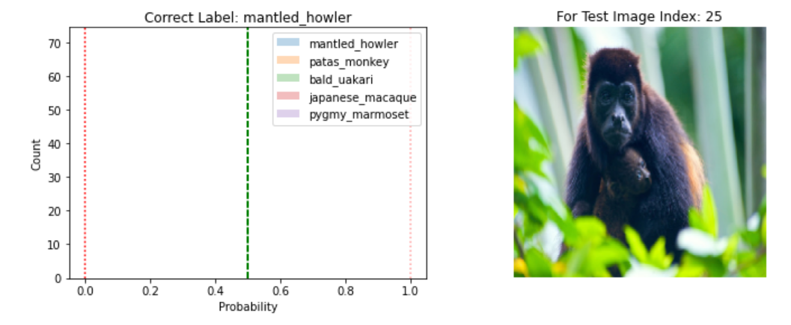

# Dropout as Bayesian Approximation for Deep Neural Network

You can run the whole notebook in Colab without issue. 
Getting helper scripts from Github repo, downloading datasets,
 and install required packages are all handled. 

### Running on local machine

* Clone repository and change directory to local copy
* Create a conda environment `conda create --name bayesian_nn`
* Activate conda environment `conda activate bayesian_nn`
* Install required libraries `pip install -r requirements.txt`
* Run jupyter lab `jupyter lab`
* Open `Dropout as Bayesian Approximation.ipynb`

## Visualizing Model Uncertainty

Data is passed through the model with `Dropout` turned on 
during the inference step for multiple times. The resulting 
probability distributions are what the model produce over 
multiple passes.

When the model is uncertain:

When the model is certain:

High certainty:

Extremely high certainty:

