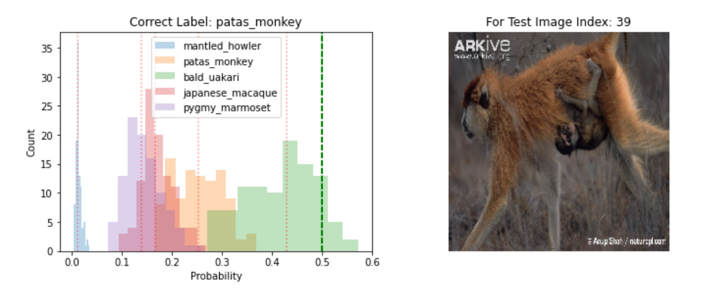

# Dropout as Bayesian Approximation for Deep Neural Network

### Running on local machine

* Clone repository and change directory to local copy
* Create a conda environment `conda create --name bayesian_nn`
* Activate conda environment `source activate bayesian_nn`
* Install required libraries `pip install -r requirements.txt`
* Run jupyter lab `jupyter lab`
* Open `Dropout as Bayesian Approximation.ipynb`

## Visualizing Model Uncertainty

Data is passed through the model with `Dropout` turned on 
during the inference step for 500 times. The resulting 
probability distributions are what the model produce over 
500 times.

When the model is certain:

When the model is uncertain:

